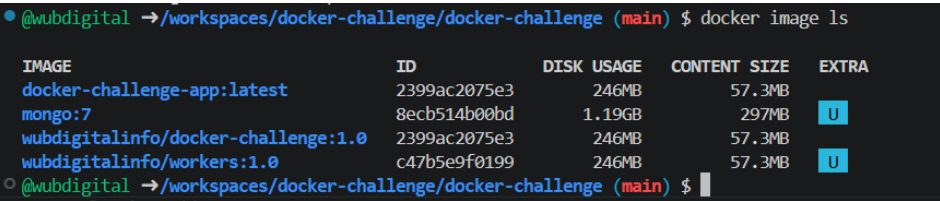
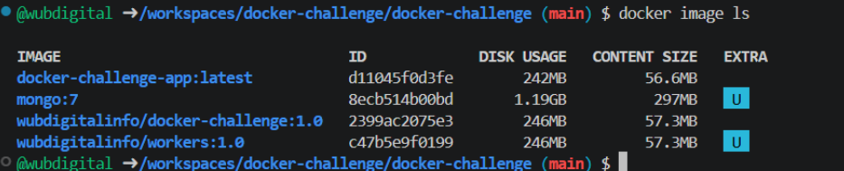
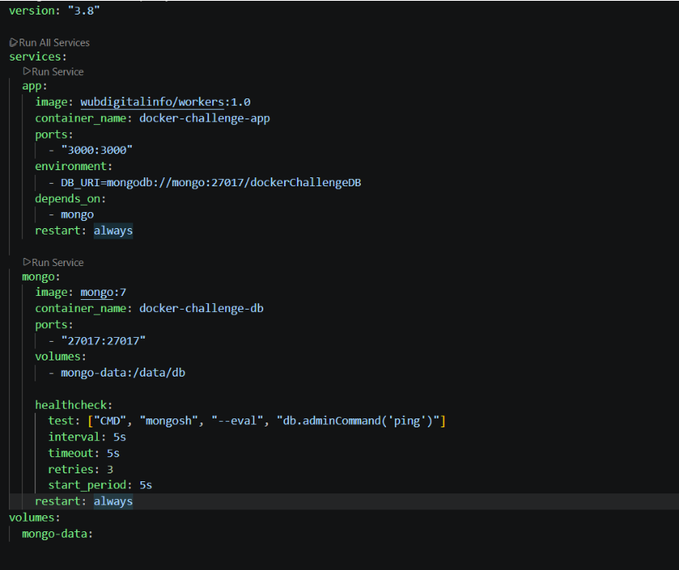
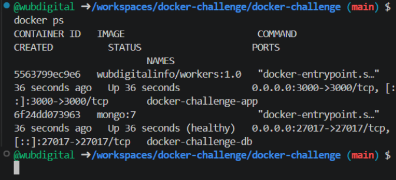
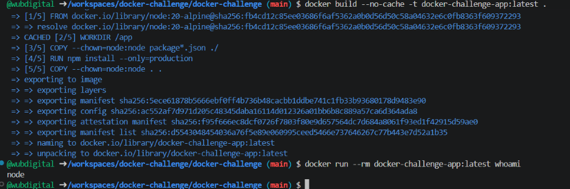
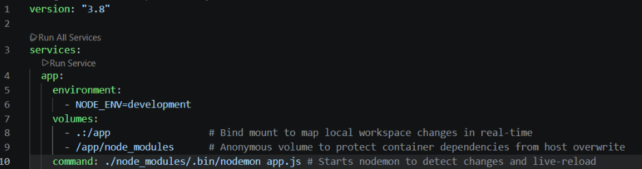
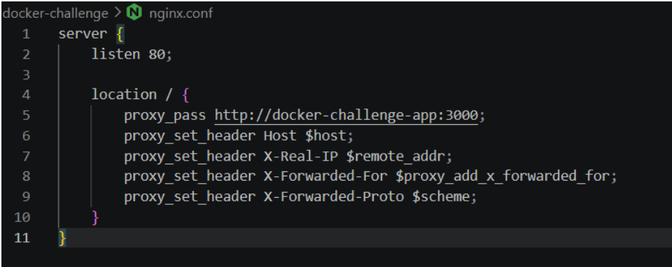
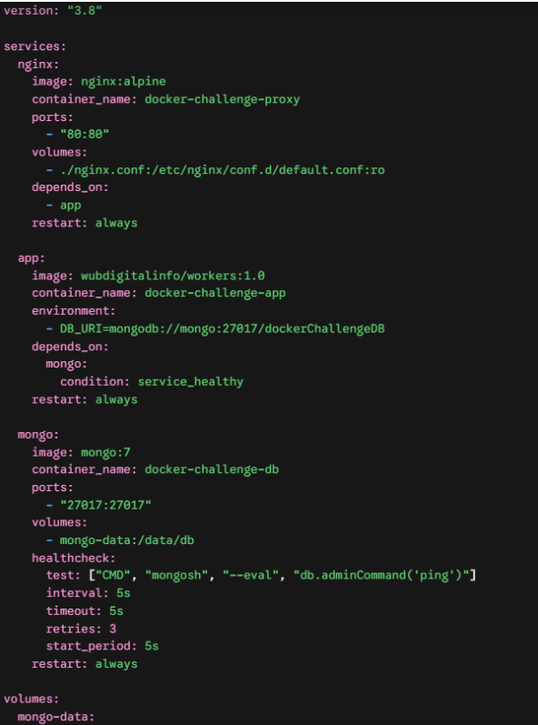

# image - multi-stage build

check docker image size: docker image ls
DISK USAGE = 246mb
CONTENT SIZE = 57mb

build stage-multi -
What is a Multi-stage Build?
A Multi-stage build is an advanced Docker technique that allows you to use multiple FROM statements in a single Dockerfile. Each FROM instruction begins a new stage of the build using a different base image.
How it works: You can use a heavy image with all development tools, dependencies, and testing frameworks in the initial stage (e.g., to run tests or compile code). Then, in the final stage, you start with a completely fresh, minimalist image and copy only the final built artifacts or production dependencies from the previous stage.
The Benefit: It keeps the final runtime image incredibly small and secure, leaving all heavy development utilities behind without requiring separate files for development and production.
source - https://docs.docker.com/get-started/docker-concepts/building-images/multi-stage-builds/

What does a .dockerignore file do?
Similar to a .gitignore file in Git, a .dockerignore file specifies a list of files and folders that Docker should completely ignore when executing the COPY or ADD commands.
Why it matters: By adding folders like node_modules or local configuration logs to .dockerignore, we prevent large, unneeded local files from being copied into the container build context. This guarantees that Docker installs its own clean dependencies directly inside the container and keeps the build context efficient and small.
source -
https://docs.docker.com/build/concepts/context/
Why do we use Alpine images?
Alpine Linux is a security-oriented, lightweight Linux distribution designed for power users who appreciate security, simplicity, and resource efficiency. It is widely adopted as the industry-standard base image for production Docker containers.
Minimal Footprint: Standard Debian or Ubuntu-based images can weigh hundreds of megabytes. In contrast, an Alpine base image is typically around 5MB, which drastically cuts down the final Docker image size.
Enhanced Security: Because Alpine contains only the absolute bare minimum required to run a Linux environment, its attack surface is extremely small, making it highly secure out of the box.
Key Considerations & Compatibility: Alpine uses musl libc instead of the standard glibc found in most Linux distributions, and uses busybox for its core utilities. This means common development tools like bash or git are not installed by default. If your application strictly relies on glibc or standard shell binaries, you may need to manually install them via the Alpine package manager (apk) inside your Dockerfile, or compile your code accordingly to avoid compatibility issues.

By rewriting the Dockerfile, we isolated the installation process using the --only=production flag and optimized our copy layers, successfully preventing development packages (such as nodemon) from entering the final image. As a result, we reduced the code layers size (CONTENT SIZE) by 0.7MB and saved a total of 4MB from the overall disk footprint (DISK USAGE).

Research Question: Why does Docker image size matter?
Optimizing Docker image size is a fundamental best practice in DevOps engineering. Minimizing image size directly impacts performance, cost, and system security across four key areas:

Faster Push/Pull Operations & Minimal Deployment Time
Every time a code update is pushed to production, the CI/CD pipeline pushes (Push) the new image to a container registry, and the hosting server pulls (Pull) it down to deploy.
Impact: A lightweight image (like a 56MB Node-Alpine image) transfers over the network in seconds. This enables near-instant deployments and lightning-fast auto-scaling during high-traffic spikes. Conversely, bulky images (measured in gigabytes) cause long bottlenecks, delay delivery pipelines, and increase container startup times (Cold Starts).
Enhanced Security (Reduced Attack Surface)
In production environments, the golden rule of security is: less code means fewer vulnerabilities.
Impact: Keeping unnecessary tools, compilers, or development packages (like nodemon) inside the production image expands the Attack Surface. If a malicious actor compromises the application, they can leverage these leftover tools to escalate privileges or exploit the host system. A minimalist, production-only image cuts down software dependencies, dramatically reducing the number of vulnerabilities flagged by security scanners.
Reduced Storage & Infrastructure Costs
Maintaining a historical registry of application versions and running multiple container instances simultaneously requires significant disk space.
Impact: Bloated images rapidly fill up the disk storage of build servers, container registries, and production clusters. Keeping images lean directly translates to lower cloud infrastructure bills by minimizing the data storage footprints required across AWS, Render, or local development environments.

# Healthcheck

Research Question: What is the difference between a "running container" and a "ready service"?
A "Running" Container: This simply means the container’s primary isolation process (like the Linux process for MongoDB) has been successfully started by the Docker engine. However, just because the process is running does not mean the application inside has finished initializing, running internal migrations, or opening its network ports to accept traffic.
A "Ready" (Healthy) Service: This means the application inside the container is fully initialized, completely awake, and actively capable of accepting incoming database queries or network connections. This state is verified externally using a configured healthcheck script.
Why is this distinction critical in production environments?
In real-world microservices architectures, deep dependencies exist between services. If a web application attempts to connect to a database or a message broker that is "running" but not yet "ready," the application will throw connection errors and crash.
While some applications can handle this via automated retry logic, relying solely on basic container startup causes unstable "race conditions." Implementing a service_healthy condition guarantees a deterministic, predictable startup order—ensuring that downstream services only spin up when their underlying database infrastructure is 100% ready to handle them.
source - https://docs.docker.com/compose/how-tos/startup-order/

Updated docker-compose.yml snippet implemented to fix the bug:

Verification & Log Proof
Deterministic Startup Order: By changing depends_on to include condition: service_healthy, we successfully eliminated the race condition bug.
Healthy Status Verification: Running docker ps confirms that the database container is actively monitored and transitions to a (healthy) state. As shown in the logs (image image_479a3a.png), both services recreate and initialize correctly, allowing the main application (docker-challenge-app) to safely establish a secure, first-time database connection with zero crash loops or initial connection retries.

Research Question: "Container Running" vs. "Service Ready"
A "Running" Container: This simply means the container’s primary isolation process (e.g., the MongoDB daemon) has been successfully initiated by the Docker engine. However, just because the process is running does not mean the database has finished its internal initialization, ran migrations, or opened its network ports to accept traffic.
A "Ready" (Healthy) Service: This means the application inside the container is fully initialized, completely awake, and actively capable of accepting incoming database queries or network connections. This state is verified externally using a configured healthcheck script.
Why is this distinction critical in production environments?
In real-world microservices architectures, deep dependencies exist between services. If a web application attempts to connect to a database or a message broker that is merely "running" but not yet "ready," the application will throw connection errors and crash.
While some applications can handle this via automated retry logic, relying solely on basic container startup causes unstable "race conditions." Implementing a service_healthy condition guarantees a deterministic, predictable startup order—ensuring that downstream applications only spin up when their underlying database infrastructure is 100% ready to handle them.

## Running Containers as a Non-Root User (Security Hardening)

Step-by-Step Security Verification

1. Checking the Initial User (Baseline Assessment)
   First, we run the whoami command inside our original container to identify the default user executing the application:
   docker run --rm wubdigitalinfo/workers:1.0 whoami
   - Output: root
   - Analysis: By default, Docker containers run processes as the privileged root user, which poses a severe security risk if the application is compromised.
2. Implementing the Security Fix in the Dockerfile
   To adhere to the principle of least privilege, we update our Dockerfile to leverage the built-in, unprivileged node user provided by the base image. We also use the --chown=node:node flag during the COPY stages to properly handle directory permissions:
   update Dockerfile file
   - Copying package files and modifying ownership to the unprivileged user
     COPY --chown=node:node package\*.json ./

   - Installing only runtime production dependencies
     RUN npm install --only=production

   - Copying application source code and modifying ownership
     COPY --chown=node:node . .

   - Switching the runtime context execution to the secure, non-root user
     USER node

3. After rebuilding the image with docker build --no-cache -t docker-challenge-app:latest ., we re-run the validation command on the newly optimized container:
   docker run --rm docker-challenge-app:latest whoami
   
   Output: node
   Conclusion: The application is now successfully and securely running under a restricted, non-root user identity. Furthermore, launching the environment with docker compose up --force-recreate verifies that file permissions are completely intact, and the application functions smoothly without any permission crashes.
   Research Question: The Risk of Privilege Escalation (Root vs. Non-Root)
   If a malicious actor successfully exploits a code-level vulnerability (such as a Remote Code Execution) and escapes or breaches the application layer, the identity of the user running the process determines the scope of the disaster:
   Scenario A: Running as root (High Risk)
   Full Host and Container Compromise: Since the process is owned by root, the attacker immediately gains unrestricted administrative privileges inside the container.
   Malicious Actions: They can freely install backdoors, download malicious binaries, modify application data, and access secret environment variables (like API keys or database credentials).
   Kernel and Host Escape: More critically, running as root makes it significantly easier for an attacker to exploit vulnerabilities in the Linux kernel or Docker runtime to break out of the container entirely and gain full administrative control over the underlying host machine (the server).
   Scenario B: Running as a regular user (node) (Secured)
   Blast Radius Containment: Running under a restricted user account applies the Principle of Least Privilege. If the application is breached, the attacker is confined to a highly restricted sandbox.
   Limited Privileges: The attacker cannot run administrative commands (sudo), cannot install system-level software, and cannot write to or modify root-owned system configurations.
   Prevention of Host Takeover: Even if they take over the process, escaping to the host server becomes incredibly difficult because the restricted permissions deny the system access required to manipulate kernel resources.

Sources & Official Documentation:

1. Docker Official Best Practices: Recommendation to use the 'USER' instruction to avoid running container processes with root privileges https://docs.docker.com/develop/develop-images/dockerfile_best-practices/#user
2. Node.js Docker Best Practices Guide: Documentation regarding the built-in, unprivileged 'node' user account and properly setting up directory permissions using '--chown' https://github.com/nodejs/docker-node/blob/main/docs/BestPractices.md#non-root-user

## Environment Separation (Development vs. Production)

1. The Multi-File Merge Mechanism
   By default, when you execute docker compose up, Docker Compose automatically evaluates the directory for a base file named docker-compose.yml and looks for an optional override file named docker-compose.override.yml. It automatically merges these configuration files together, using the override file to layer environment-specific specifications on top of the base configuration.
2. Dual Runtime Environments Configuration
   A. Development Mode (Dev Environment)
   - Goal: Maximize development speed with live updates (Hot Reload) and full development dependency access.
   - Execution Command: docker compose up
   - Configuration Implementation (docker-compose.override.yml):
     

   B. Production Mode (Prod Environment)
   - Goal: A completely locked down, minimalist runtime environment built exclusively for peak stability, maximum performance, and absolute security.
   - Execution Command: docker compose up --build
     Behavior: The application runs purely on the code "baked" into the immutable image layers, running node app.js securely without any live file sync capabilities, host dependencies, or development packages.

3. Dual Runtime Execution Commands
   To satisfy the operational requirement of running each environment via distinct commands, use the following workflows:
   Local Development Mode
   To initiate the merged configuration (Base + Override) with Hot Reload active, execute: docker compose up
   Explanation of Behavior: By default, Docker Compose looks for both docker-compose.yml and docker-compose.override.yml in the current working directory, automatically combining them.
   Production Mode
   To enforce a clean deployment while completely isolating the runtime from local development configs and tools,
   execute: docker compose -f docker-compose.yml up --build

4. Technical Breakdown of the Merge Logic (How it works)
   When executing the development workflow, Docker Compose applies structural inheritance rules to merge the files:
   - Environment Variable Merging: The NODE_ENV=development declaration inside the override layer appends to (or overwrites) the existing environment array mapped in the base configuration.
   - Volume Array Combination: Compose merges the lists of volumes. The bind mount (.:/app) maps the host filesystem to allow instant code updates, while the anonymous volume (/app/node_modules) tells Docker to keep the container's built-in dependencies safe from being wiped out by the local directory.
   - Command Hijacking: The runtime execution instruction (node app.js) defined in your base file is fully overridden by the development binary string (./node_modules/.bin/nodemon app.js), activating the hot-reload engine.

Research Question: Bind Mounts in Dev vs. Production
Why are Bind Mounts vital during Development?
During the active local coding phase, maximizing Developer Experience (DX) is critical. Using a bind mount bridges the host machine's local file system directly with the container's isolated workspace. This creates an instantaneous feedback loop—whenever a file is modified inside an IDE like VS Code, the change reflects inside the running container in milliseconds, allowing tools like nodemon to instantly restart the application. This eliminates the massive, time-consuming bottleneck of rebuilding the entire Docker image for every minor code fix.
Why are Bind Mounts highly discouraged in Production?
Production environments demand absolute structural isolation and immutability based on two core architectural factors:
Determinism and Immutability: A production container should be an absolute immutable artifact. Baking the code directly inside the image layers ensures that the container behaves identically across staging servers, local setups, and massive auto-scaling production clusters, completely eliminating "it works on my machine" bugs.
Security & Container Breakout Prevention: Attaching a bind mount creates a direct bridge between the host OS server filesystem and the virtualized container environment. If a malicious attacker compromises a web application running with an active bind mount in production, it drastically widens the blast radius, giving them an easier pathway to tamper with or escape directly into the hosting cloud server.
Sources & Official Documentation:

1. Docker Compose Multi-File Merging: Official architecture guide detailing the merging behavior of multi-file configurations https://docs.docker.com/compose/how-tos/multiple-compose-files/merge

2. Docker Bind Mounts Architecture: Best practices specifying usage of host-filesystem bindings across environments https://docs.docker.com/engine/storage/bind-mounts

# Implementing Nginx as a Reverse Proxy

1. Conceptual Breakdown: What is a Reverse Proxy?
   In enterprise production architecture, internal application servers (like our Node.js runtime) are practically never exposed directly to the public internet. Instead, an edge web server like Nginx is deployed at the perimeter to act as a Reverse Proxy.
   It serves as a single entry point (listening on standard HTTP port 80). When a client sends a request to the server, Nginx interceptively captures the traffic, processes the headers, and transparently routes the request over the internal isolated virtual Docker network to our application service running safely in the background.
2. Production Architecture Implementation
   To decouple the application container from direct ingress traffic, the configuration was refactored into two structural components:
   A. Edge Proxy Rules Layout (nginx.conf)
   This newly introduced configuration explicitly maps traffic ingress rules, passing upstream headers directly to the internal container DNS name:
   

B. Unified Container Orchestration Layer (docker-compose.yml)
The ports array was completely stripped away from the app configuration block, ensuring it cannot be reached directly via host port 3000. Port exposure is bound exclusively to Nginx:

Research Question: Architectural Benefits of a Reverse Proxy
Deploying Nginx ahead of Node.js provides crucial advantages that cannot be achieved by a standalone Node application:
Internal Port Obfuscation & Security: By severing the host port mapping to port 3000, the application is completely cloaked inside the Docker network. Attackers scanning perimeter ports cannot discover what technology stack or internal port mappings run behind the proxy boundary.
TLS/SSL Termination Capabilities: Offloading processing-heavy encryption mechanics (HTTPS certificates/handshakes) to Nginx frees up the Node.js event loop to focus entirely on application logic and core database queries.
High-Performance Static File Serving: Node.js is inherently slow at streaming assets from disk. Nginx can cache and serve static objects (images, CSS, frontend HTML) directly via kernel-level operations (sendfile), bypassing the application server entirely to dramatically decrease response times.
Seamless Load Balancing Configuration: If scaling is required to handle traffic spikes, Nginx can natively act as a Load Balancer, executing scheduling algorithms (like Round Robin) to split runtime traffic across multiple replicated application instances seamlessly.
Verification Result
Executing docker compose up --build instantiates all three components concurrently. Navigating to http://localhost verifies successful deployment: the browser successfully renders the interface through port 80, proving transparent and secure end-to-end network routing.
Sources & Official Documentation:

1. Nginx Reverse Proxy Architecture: Reference manuals detailing HTTP proxy configuration and header manipulation guidelines https://nginx.org/en/docs/http/ngx_http_proxy_module.html

2. Docker Compose Networking Specifications: Core principles of container service discovery and internal isolated subnets https://docs.docker.com/compose/networking
